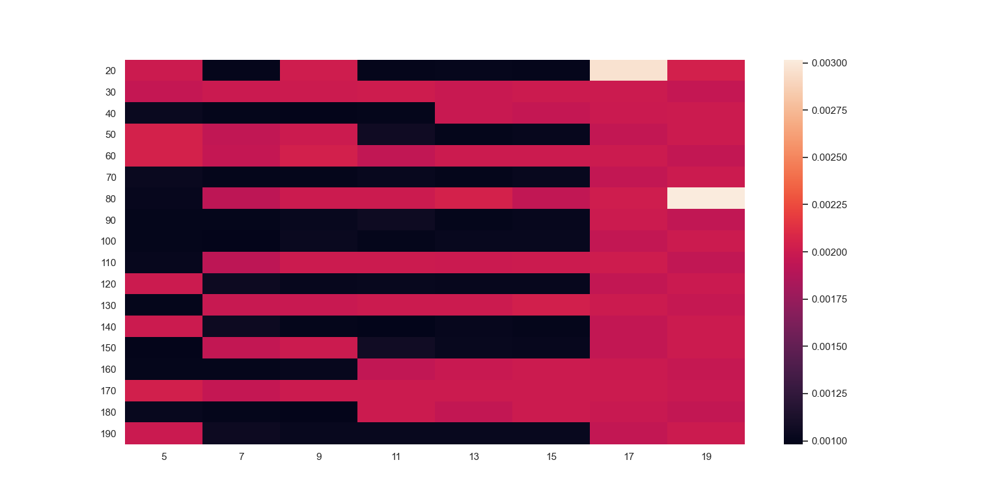
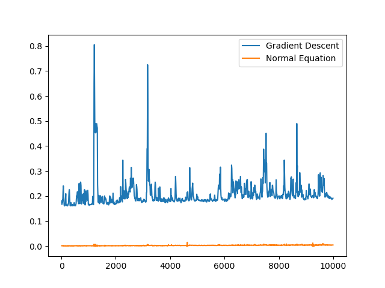

# ES654-2020 Assignment 3

*Your Name* - *Your Roll Number*

------

> Write the answers for the subjective questions here

Theoretical time complexity for normal method is O(P^2 * N) + O(D^3)
Theoretical time complexity for gradient descent method is O((t+N) * D^2)

- For normal equation, for a constant N, as P increases, there is huge increase in time computation as seen in heat map

- The time complexity increases as a product of number of samples and number of dimensions while keeping number of iterations constant.

## Heatmaps

### For gradient descent 

### For Normal method

## Using matplotlib

### Varying N

### Varying P
